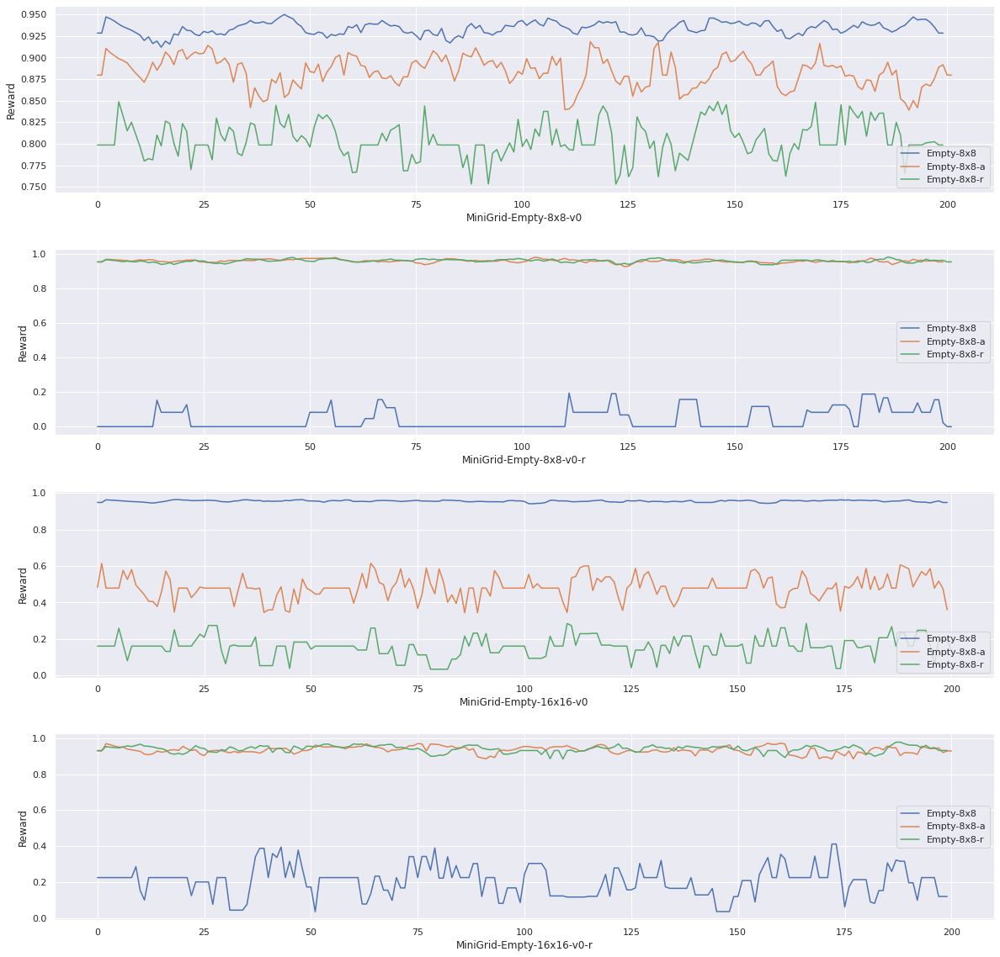

UGVR

# Meeting1 05/23

## Summary

- Problems faced: <hard exploration> 
    - Difficulty in the task level.
    - Smooth transition between generated tasks.
    - Modeling distance between tasks.
- Current hypothesis:
    - Given target task.
    - Expert demonstration is available (for any task).
- Current focus: **find the range of our technical contribution**
    - We definitely cannot solve any thing, so find out what we really want to solve.

## TODO

- Benchmarking
    - [x]Reinforcement Learning.
    - []IL

## Result

- Benchmarking using RL in [gym-minigird](https://github.com/maximecb/gym-minigrid).
    - 
- Algorithm: `PPO`
- Comparison between `original`, `random`, `hand-code auto task generation`.
    - Training: all in `MiniGrid-Empty-8x8-v0`
        - `original`: original environment, the positions of agent and goal are fixed. (diagonal)
        - `random`: the agent's position is fixed, but the goal is randomly generated.
        - `hand-code auto task generation`: The goal is k-steps away from the agent's birth point, and $k = log_nT$, where n is constant, and T is the index of the episode. 
    - Testing: in `MiniGrid-Empty-8x8-v0` and `MiniGrid-Empty-16x16-v0`
        - Two scenarios are considered, `fixed-target` and `random-target`
- Result:
    - During training
    - 
        - ` `: fixed target
        - `-a`: hand-code auto task generation
        - `-r`: random generation
    - During testing
    - 
    - Four test environments: `8x8 fixed&&random`, `16x16 fixed && random`, 200 episodes each.
    - Note that:
        - Clearly `origina` agent (trained with fixed target) is over-fitting.
        - Basically, `hand-code auto task generation` agent performs better, and takes less time for converge.
- :negative_squared_cross_mark: Tried but Failed
    - Algorithm doesn't converges in `MiniGrid-FourRoom-v0`.
    - Using RL algorithm from our lab ([tianshou](https://github.com/thu-ml/tianshou)) for training.

## Some thoughts

- Maybe we can add *robustness* into our consideration.
    - Compared with training only in given task, using task generation creates a more diverse training environment, and thus makes the agent more robust under noise conditions.

